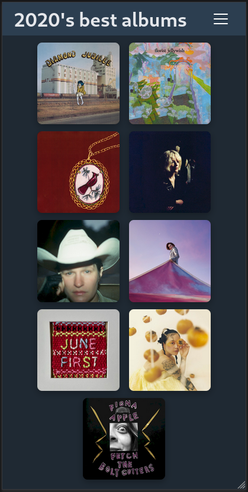

# <div align=center> aoife | [demo](https://aoife.brege.org) </div>

A multi-media poster matrix for creating year-in-review galleries of movies, TV shows, books, music albums, video games, and more.

Play with [the prototype](https://aoife.brege.org)!

## Features

- Search and collect posters from different media APIs
- Simple search and poster picker
- Responsive and configurable grid layout
- Alternate poster selection with swipe gestures or grid selection 
- Editable titles and shareable URLs
- Input hiding for poster-maxxing screenshots

## Examples

Ever wanted to share a screenshot of your favorite things you read, saw or watched?
**aoife** fetches poster and cover art into a minimalist grid to share with your friends.

<table>
  <tr><td colspan="3"><b>Mobile</b></td></tr>
  <tr>
    <td></td>
    <td></td>
    <td></td>
  </tr>
</table>
<br>
<table>
  <tr><td colspan="3"><b>Desktop</b></td></tr>
  <tr>
    <td></td>
    <td></td>
  </tr>
</table>

### Share URLs

URLs have memorable slugs so it's easier to manual copy between devices.  From the screenshots above:

**Music Albums** [?share=guava-buttermilk-savory](https://aoife.brege.org/?share=guava-buttermilk-savory)

**Mixed Media** [?share=chardonnay-horseradish-kiwi](https://aoife.brege.org/?share=chardonnay-horseradish-kiwi)


## Setup

```bash
git clone git@github.com:brege/aoife.git
cd aoife
npm install
npm run dev
```

This will start a [Vite](https://vitejs.dev/) React server, which will print the local URL and port number to console.

**aoife** has an API that's easy to curl and test behaviors against through a CLI bridge. In production, the backend, `backend/`, is served by a Flask server with Gunicorn workers. Vite is only used in development and building `dist/`.

API Keys are not included in the repo. They are configured in a `.env` file.

```
VITE_TMDB_API_KEY=abcdefghijklmnopqrstuvwxyz
VITE_GAMESDB_PUBLIC_KEY=zyxwvutsrqponmlkjihgfedcba
```

> aoife has no plans to store pictures. Any photos uploaded via the **Custom** option are stored in localStorage in your browser. Share URLs are therefore limited to grids containing **only** canonically sourced images from the cover picker's API sources. You can still make nice screenshots to send to your friends. If you want to save custom-art arrangements, the development server will provide the same reproducible, custom three-slug URLs at your localhost.

## Development

- **[contributing](docs/contributing.md)**

- **[roadmap](docs/roadmap.md)**

- **[changelog](docs/changelog.md)**

## License

[GPLv3](https://fsf.org/licensing/licenses/gpl-3.0)
