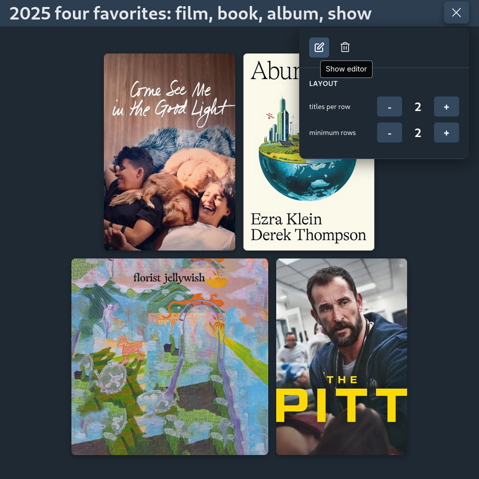
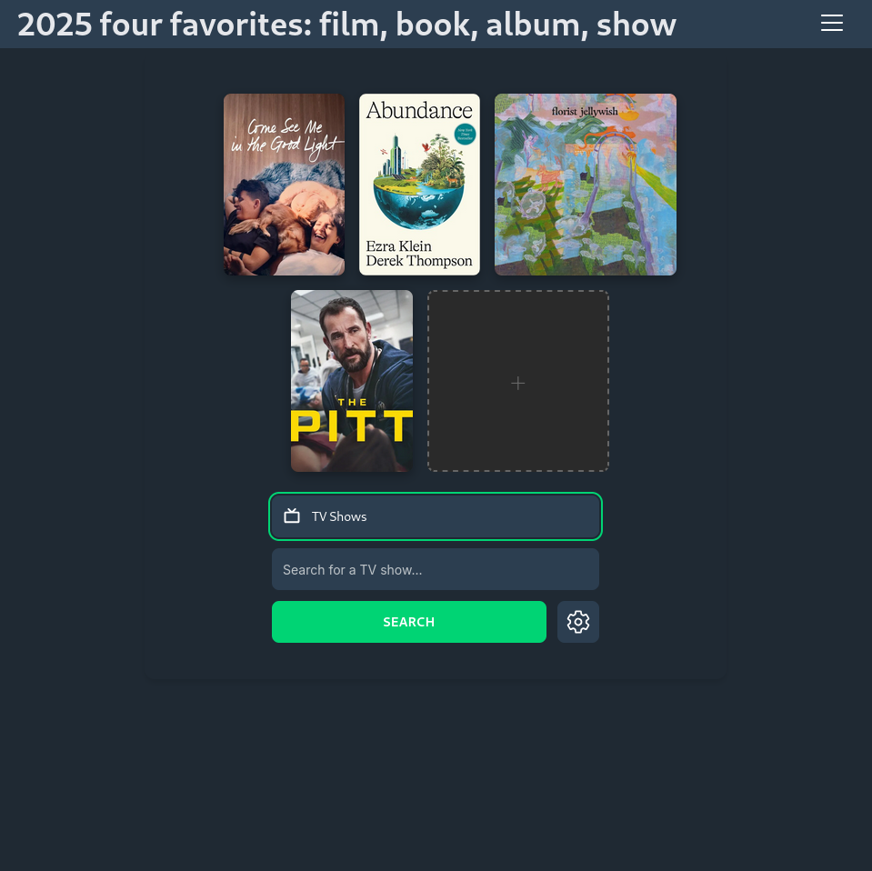

# aoife

A clean, responsive media collection tool for creating year-in-review, favorite films, etc galleries.

## Features

- Search and collect posters using different media APIs
- Dual-mode display: compact building mode and adaptive gallery view
- Responsive grid layout
- Alternate poster selection and editable title

## Examples

<table>
  <tr><td colspan="3"><b>Mobile</b></td></tr>
  <tr>
    <td></td>
    <td></td>
    <td></td>
  </tr>
</table>


<br>

<table>
  <tr><td colspan="3"><b>Desktop</b></td></tr>
  <tr>
    <td colspan="2"></td>
    <td></td>
  </tr>
</table>

No judgement please.

## Installation

```bash
git clone git@github.com:brege/aoife.git
cd aoife
npm install
npm run dev
```

This is a [Vite](https://vitejs.dev/) server in React, which will print the local URL and port number to console.

Add your TMDB API key to `.env`:
```
VITE_TMDB_API_KEY=your_key_here
```

## Development

- **[contributing](docs/contributing.md)**

- **[roadmap](docs/roadmap.md)**

- **[changelog](docs/changelog.md)**

## License

[GPLv3](https://fsf.org/licensing/licenses/gpl-3.0)
