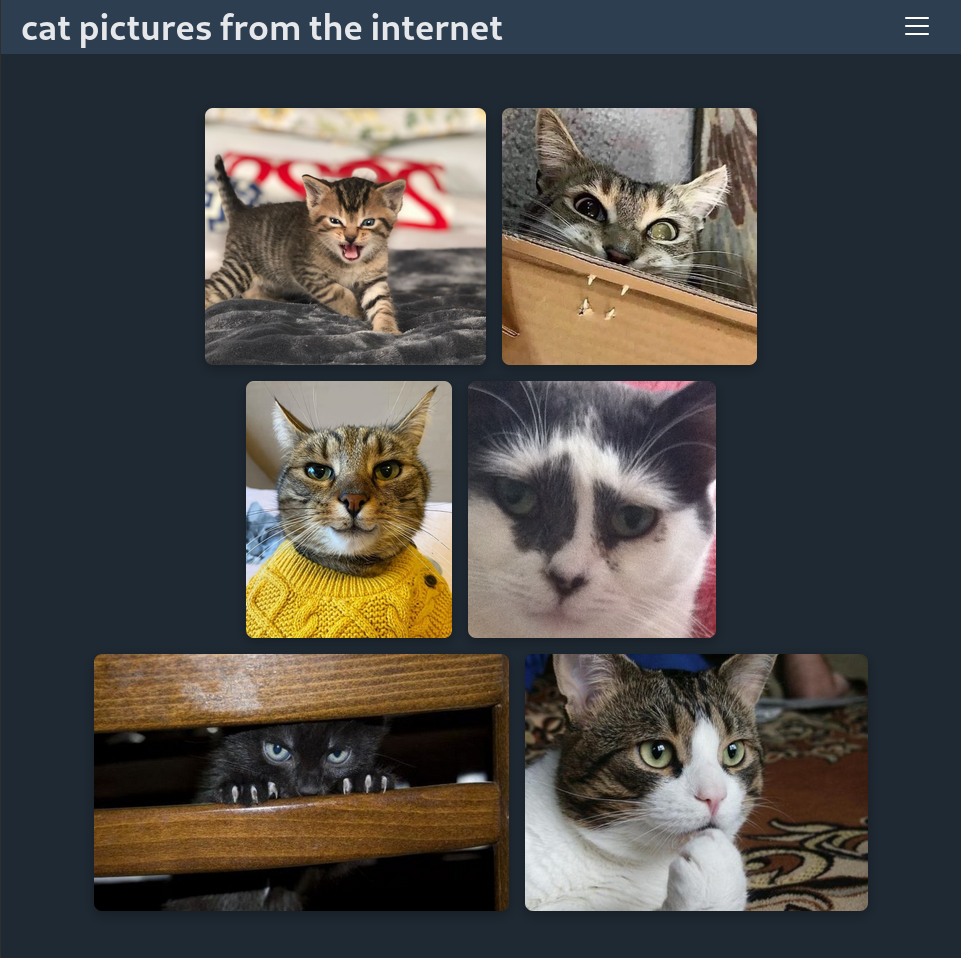

# <div align=center> aoife | [demo](https://aoife.brege.org) </div>

A multi-media poster matrix for creating year-in-review galleries of movies, TV shows, books, music albums, video games, and more.

Play with [the prototype](https://aoife.brege.org)!

## Features

- Search and collect posters using different media APIs
- Compact builder mode and adaptive, clean gallery view
- Responsive and configurable grid layout 
- Alternate poster selection and editable titles

## Examples

Ever wanted to share a screenshot of your favorite things you read, saw or watched?
**aoife** fetches poster and cover art into a minimalist grid to share with your friends.

<table>
  <tr><td colspan="3"><b>Mobile</b></td></tr>
  <tr>
    <td></td>
    <td></td>
    <td></td>
  </tr>
</table>
<br>
<table>
  <tr><td colspan="3"><b>Desktop</b></td></tr>
  <tr>
    <td></td>
    <td></td>
    <td></td>
  </tr>
</table>

No judgement please.

## Installation

```bash
git clone git@github.com:brege/aoife.git
cd aoife
npm install
npm run dev
```

This will start a [Vite](https://vitejs.dev/) React server, which will print the local URL and port number to console.

API Keys are not included in the repo. They are configured in a `.env` file.

```
VITE_TMDB_API_KEY=abcdefghijklmnopqrstuvwxyz
VITE_GAMESDB_PUBLIC_KEY=zyxwvutsrqponmlkjihgfedcba
```

## Development

- **[contributing](docs/contributing.md)**

- **[roadmap](docs/roadmap.md)**

- **[changelog](docs/changelog.md)**

## License

[GPLv3](https://fsf.org/licensing/licenses/gpl-3.0)
