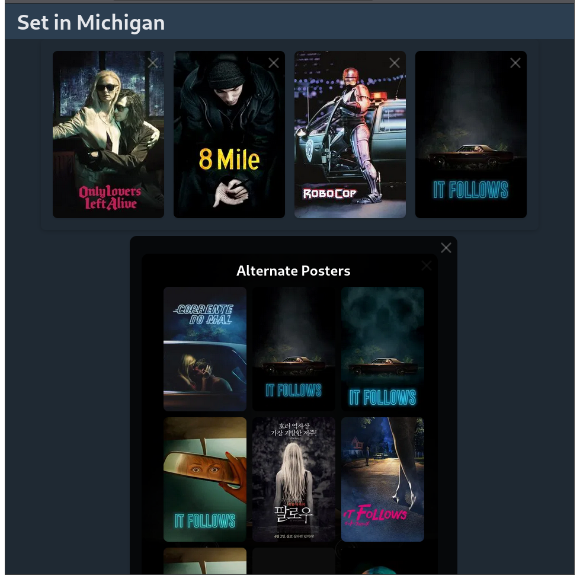

# aoife

A clean, responsive media collection tool for creating year-in-review, favorite films, etc galleries.

## Features

- Search and collect media using different APIs
- Dual-mode display: compact building mode and adaptive gallery view
- Responsive grid layout
- Alternate poster selection

## Examples

| Desktop | Mobile |
|:------- |:------ |
|  |  |


## Installation

```bash
npm install
npm run dev
```

Add your TMDB API key to `.env`:
```
VITE_TMDB_API_KEY=your_key_here
```

## Tech Stack

- React + TypeScript
- Vite for build and development
- CSS Grid for responsive layouts
- TMDB API for movie/TV data (more to come)
- Biome for linting, formatting, and type checking

## Development

```bash
npm run dev     # start development server
npm run build   # build for production
npm run lint    # run biome linter
```

## Roadmap

- [x] **Movies** (TMDB API)
- [ ] **TV Shows** (TMDB API)
- [ ] **Games**
  - IGDB (Internet Game Database)
  - Giant Bomb API
  - Steam API
- [ ] **Books**
  - Google Books API
  - Open Library API
- [ ] **Music**
  - Last.fm API
  - Spotify Web API
  - MusicBrainz API
- [ ] **Podcasts**
  - Listen Notes API
  - iTunes Search API
  - Podcast Index API
- [ ] **Websites/Bookmarks**
  - Web scraping (Open Graph)
- [ ] **Scientific Articles**
  - arXiv API
  - PubMed API
  - CrossRef API

Once a handful of these have been implemented, I will begin expanding to mixed media year-in-review galleries.  Maybe you'd want to see

#### My 2025 Year-in-Review
|       |         |         |
|:----- |:------- |:------- |
| Movie | TV Show | Game    |
| Album | Book    | Podcast |

## License

[GPLv3](https://fsf.org/licensing/licenses/gpl-3.0)
