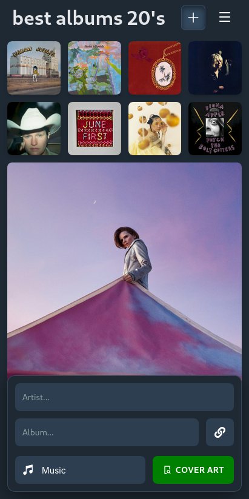
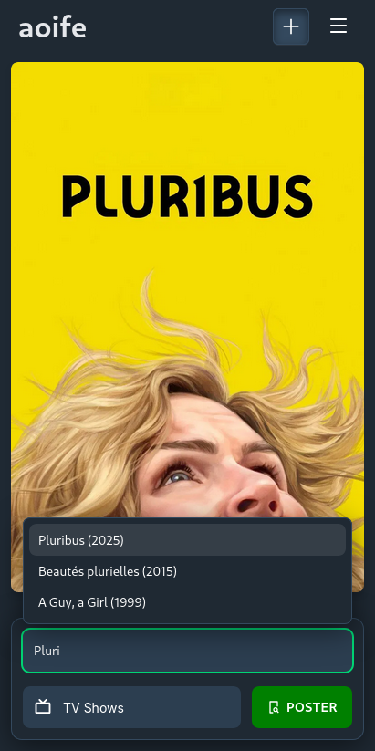
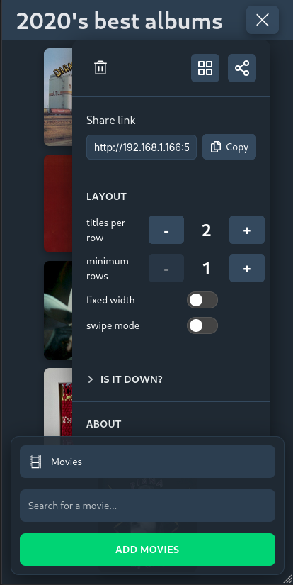
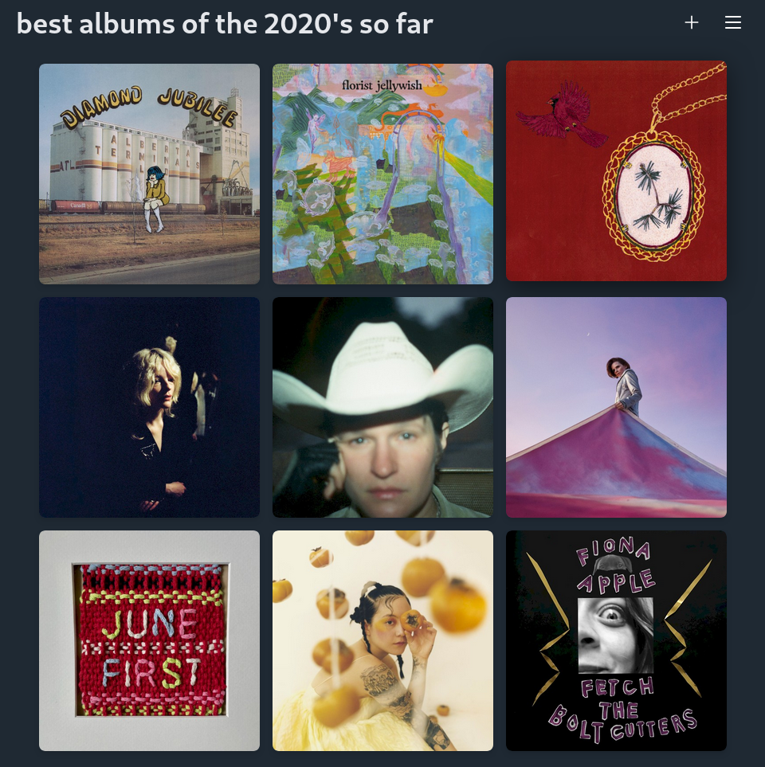
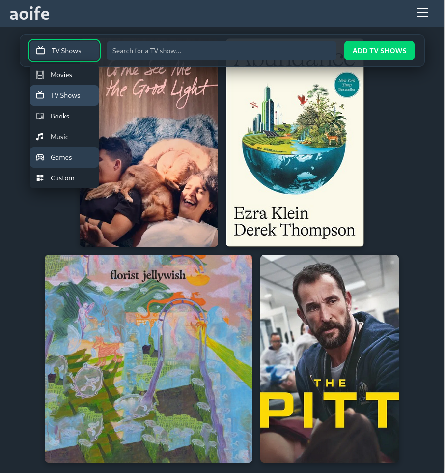

# <div align=center> aoife | [demo](https://aoife.brege.org) </div>

A multi-media poster matrix for creating personal collages of movie and TV show posters, books and music album cover art, video game box art, or any collection of external images.

**Play with [the prototype](https://aoife.brege.org)!**

## Features

- Search and collect posters and artwork from different media APIs
- Simple search and poster picker
- Responsive and configurable grid layout
- Alternate poster selection with swipe gestures or grid selection 
- Editable titles, captions, and generate shareable URLs
- Input hiding for poster-maxxing screenshots

## Examples

Ever wanted to share a collage of your favorite albums and shows in one unified screenshot?
**aoife** fetches poster and cover art into a minimalist grid to share with your friends.

### Mobile

<table>
  <tr>
    <td></td>
    <td></td>
    <td></td>
  </tr>
</table>

### Desktop

<table>
  <tr>
    <td></td>
    <td></td>
  </tr>
</table>

### Share URLs

URLs have memorable slugs so it's easier to manually copy between devices.  From the screenshots above:

- **Music Albums** [?share=guava-buttermilk-savory](https://aoife.brege.org/?share=guava-buttermilk-savory)
- **Mixed Media** [?share=chardonnay-horseradish-kiwi](https://aoife.brege.org/?share=chardonnay-horseradish-kiwi)
- **The above screenshot table** [?share=cakes-pomelos-carrots](https://aoife.brege.org/?share=cakes-pomelos-carrots)

## Running aoife Locally

```bash
git clone git@github.com:brege/aoife.git
cd aoife
npm install
npm run dev
```

This will start a [Vite](https://vitejs.dev/) React server, which will print the local URL and port number to console. **aoife** has an API that's easy to curl and test behaviors against through its CLI bridge. In production, the backend, `backend/`, is served by Flask/Gunicorn workers. Vite is only used in development and building `dist/`.

API Keys are not included in the repo. They are configured in a `.env` file.
```
TMDB_API_KEY=abcdefghijklmnopqrstuvwxyz
GAMESDB_PUBLIC_KEY=zyxwvutsrqponmlkjihgfedcba
```

See [Contributing](docs/contributing.md) for infra and testing.

> [!NOTE]
> aoife has no plans to host images. Any images uploaded via the **Custom** option are stored in localStorage in your browser. **Permalinking is limited to only URL-based images.** Use a service like [catbox](https://catbox.moe/), [immich](https://immich.app/), or [pixelfed](https://pixelfed.org/) to host images by URL.

## Development

- **[contributing](docs/contributing.md)**

- **[roadmap](docs/roadmap.md)**

- **[changelog](docs/changelog.md)**

## License

[GPLv3](https://fsf.org/licensing/licenses/gpl-3.0)
